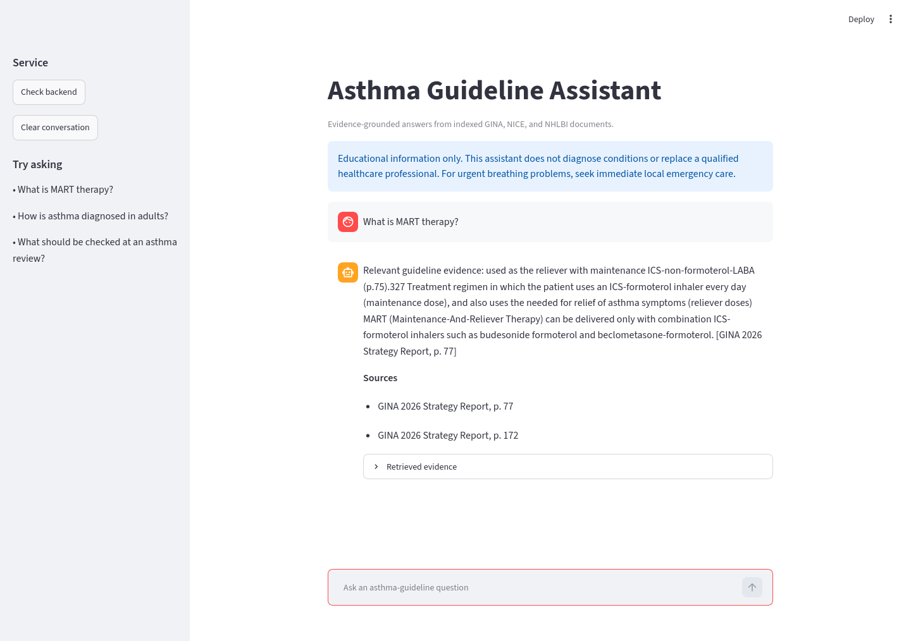
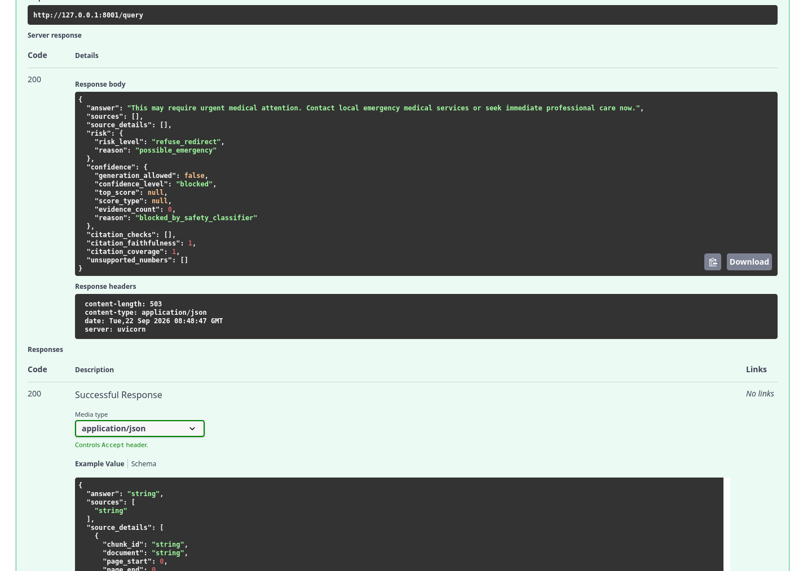

# Asthma Guideline RAG Assistant

A complete Core Track Retrieval-Augmented Generation application that answers
educational asthma-guideline questions using official GINA, NICE, and NHLBI
documents. It uses hybrid retrieval, local Ollama generation, page-level
citations, and deterministic safety checks.

> This project provides educational information only. It does not diagnose,
> prescribe, replace clinical judgment, or provide emergency medical care.

## Implementation status

Implemented and locally verified on 2026-09-22:

- all 3 PDFs and 374 pages parse successfully; none require OCR
- the notebook executes top-to-bottom with 515 section-aware chunks and 515
  persisted Chroma records
- BGE dense retrieval, persisted BM25, query expansion, and reciprocal-rank
  fusion
- bounded query-aware evidence compression, local `llama3.2:1b`, one
  correction attempt, citation/numeric verification, and a verified verbatim
  fallback
- FastAPI `GET /health` and `POST /query`, Streamlit chat, evidence display,
  fail-closed English/Arabic asthma-scope filtering, deterministic
  medical-safety handling, and CORS
- 64 passing automated tests, clean Ruff lint/format checks, successful Python
  compilation, and consistent installed dependencies
- executed 12-case retrieval and 15-case answer/safety evaluations
- cold-cache API and browser-driven Streamlit/Swagger acceptance tests

The small runtime artifacts (about 16 MB) are included so the API can load the
index without rebuilding. Raw publisher PDFs, model weights, embedding
checkpoints, secrets, and the downloaded reference repository remain excluded.
GitHub publication, instructor demo, recorded walkthrough, and clinical-expert
answer review are owner-controlled submission steps.

## Architecture

~~~mermaid
flowchart LR
    PDFs[Official PDFs] --> Notebook[Notebook: inspect and clean]
    Notebook --> Chunks[Section-aware chunks]
    Chunks --> Dense[BGE-base and Chroma]
    Chunks --> Sparse[BM25]
    Dense --> Fusion[Reciprocal Rank Fusion]
    Sparse --> Fusion
    Fusion --> Gate[Safety and evidence gate]
    Gate --> Compress[Query-aware evidence compression]
    Compress --> Ollama[Local Ollama]
    Ollama --> Verify[Citation and numeric checks]
    Verify --> Fallback[Verified extractive fallback if needed]
    Fallback --> API[FastAPI]
    API --> UI[Streamlit]
~~~

Offline index building is separate from online query serving. FastAPI loads
persisted artifacts once during lifespan and does not rebuild them per request.

## Tech stack

- Python 3.12.3 and Jupyter 1.1.1
- pypdf 6.19.0 plus cryptography 46.0.7
- Sentence Transformers 6.1.0 with `BAAI/bge-base-en-v1.5`
- Chroma 1.5.9
- bm25s 0.3.11
- Ollama 0.34.2 with `llama3.2:1b`
- FastAPI 0.141.1 and Uvicorn 0.53.0
- Streamlit 1.64.0
- pytest 8.4.2 and HTTPX 0.28.1

## Project structure

    .github/workflows/       Automated quality gates
    backend/                 FastAPI application, runtime artifacts, and tests
    data/                    Corpus manifest and local raw documents
    docs/images/             Verified UI and Swagger screenshots
    docs/phases/             Detailed implementation phases and reuse map
    eval/                    Evaluation fixtures and measured results
    frontend/                Streamlit application and client tests
    notebooks/               Reproducible RAG notebook
    scripts/                 Notebook builder and corpus validator
    graduation_project_guide.md

The downloaded reference repository is intentionally ignored and must not be
published with the submission.

## Data

All files were retrieved on 2026-09-21.

| Document | Version | Pages | Official source |
|---|---|---:|---|
| GINA Strategy Report | 2026 | 298 | https://ginasthma.org/2026-gina-strategy-report/ |
| NICE NG245 | Published 2024 | 64 | https://www.nice.org.uk/guidance/ng245 |
| NHLBI Asthma Care Quick Reference | January 2012 | 12 | https://www.nhlbi.nih.gov/resources/asthma-care-quick-reference-diagnosing-and-managing-asthma |

Raw PDFs are ignored until redistribution terms are confirmed. Download
instructions and exact hashes are in data/raw/README.md and data/manifest.json.
Citations use one-based PDF page numbers.

Validate quickly:

    .venv/bin/python scripts/validate_corpus.py --skip-text-check

Validate text extraction:

    .venv/bin/python scripts/validate_corpus.py

## Setup

For copy-and-paste local and Docker startup commands, see
[`start.md`](start.md).

### 1. Create an environment

Linux/macOS:

    python3 -m venv .venv
    source .venv/bin/activate
    pip install -r backend/requirements.txt -r frontend/requirements.txt
    pip install -r requirements-dev.txt

Windows PowerShell:

    py -m venv .venv
    .venv\Scripts\Activate.ps1
    pip install -r backend/requirements.txt -r frontend/requirements.txt
    pip install -r requirements-dev.txt

### 2. Install and start Ollama

Install Ollama using its official instructions, then:

    ollama pull llama3.2:1b
    ollama list

### 3. Use or rebuild the RAG artifacts

The repository includes the small persisted Chroma/BM25 stores, chunk catalog,
and runtime configuration. To reproduce them from the official PDFs, place the
files described in `data/raw/README.md`, then open and run:

    notebooks/rag_pipeline.ipynb

Use Kernel → Restart & Run All. The first BGE model download is kept
in the normal model cache, not this repository.

The notebook exports:

    backend/data/vector_store/chroma/
    backend/data/vector_store/bm25/
    backend/data/chunks.jsonl
    backend/data/rag_config.json
    backend/data/notebook_evaluation.csv

### 4. Run FastAPI

    cp backend/.env.example backend/.env
    cd backend
    uvicorn app.main:app --reload --port 8000

Swagger:

    http://localhost:8000/docs

Health:

    curl http://localhost:8000/health

Query:

    curl -X POST http://localhost:8000/query \
      -H "Content-Type: application/json" \
      -d '{"question":"What is MART therapy?"}'

### 5. Run Streamlit

In another terminal:

    cp frontend/.env.example frontend/.env
    cd frontend
    streamlit run app.py --server.port 8501

Open http://localhost:8501.

## Environment variables

### Backend

| Variable | Default | Purpose |
|---|---|---|
| APP_NAME | Asthma Guideline RAG | API title |
| APP_VERSION | 0.1.0 | API version |
| OLLAMA_BASE_URL | http://localhost:11434 | Ollama server |
| OLLAMA_MODEL | llama3.2:1b | CPU-friendly local generation model |
| OLLAMA_NUM_PREDICT | 96 | Maximum generated tokens per attempt |
| OLLAMA_NUM_CTX | 2048 | Ollama context-window size |
| VECTOR_STORE_PATH | data/vector_store/chroma | Chroma artifact |
| RAG_CONFIG_PATH | data/rag_config.json | Index configuration |
| CHUNKS_PATH | data/chunks.jsonl | Full chunk catalog |
| SAFETY_RULES_PATH | app/core/safety_rules.json | Versioned deterministic safety policy |
| FRONTEND_ORIGINS | Local Streamlit origins | CORS allowlist |
| LOG_LEVEL | INFO | Application logging |
| REQUEST_TIMEOUT_SECONDS | 600 | Ollama timeout for CPU-only inference |
| RETRIEVAL_TOP_K | 5 | Final evidence count |
| MAX_QUESTION_CHARS | 2000 | Input bound |

### Frontend

| Variable | Default | Purpose |
|---|---|---|
| API_BASE_URL | http://localhost:8000 | FastAPI server |
| API_TIMEOUT_SECONDS | 660 | Frontend request timeout |

## API

### GET /health

Reports liveness, RAG readiness, collection size, and Ollama model readiness.
Before notebook artifacts or Ollama exist, it returns a degraded payload rather
than hiding the missing dependency.

### POST /query

Request:

    {"question": "What is MART therapy?"}

Required response fields:

    {
      "answer": "Grounded answer with citation...",
      "answer_mode": "ollama",
      "generation_attempts": 1,
      "sources": ["GINA 2026 Strategy Report, p. 77"]
    }

The response also provides typed source details, risk, confidence, citation
checks, citation faithfulness, citation coverage, and unsupported numbers.
`answer_mode` reports whether the released answer came from the first Ollama
draft, a corrected Ollama draft, an extractive fallback, or a refusal path.

Backend logs use the same request ID for retrieval, each generation attempt,
verification, fallback selection, and the final response. They report the
answer mode, attempt count, citation metrics, unsupported-number count, and
source count without logging the raw question or answer.

Validation failures return 422. A missing index or unavailable model returns
503, generation timeouts return 504, and unexpected controlled service errors
return 500 without exposing local paths or secrets.

## Docker

The required backend image includes the persisted runtime artifacts. Build it
from the project root:

    docker build -t asthma-rag-api backend

Ollama remains a host prerequisite. On Linux, run with a host mapping:

    docker run --rm -p 8000:8000 \
      --add-host=host.docker.internal:host-gateway \
      -e OLLAMA_BASE_URL=http://host.docker.internal:11434 \
      asthma-rag-api

Set `FRONTEND_ORIGINS` if Streamlit is not served from the documented local
origin.

## Evaluation

The notebook evaluates:

- 12 retrieval questions, including a negative case
- 15 answer/safety cases
- Precision@3 and Precision@5
- Hit Rate@3, @5, and @10
- Mean Reciprocal Rank
- grounding, citation, unsupported-number, refusal, and safety behavior

Measured on Linux with Python 3.12.3, Ollama 0.34.2,
`BAAI/bge-base-en-v1.5`, and `llama3.2:1b` on two CPU inference threads:

| Retrieval metric | Result |
|---|---:|
| Precision@3 | 0.242 |
| Precision@5 | 0.182 |
| Hit Rate@3 | 0.727 |
| Hit Rate@5 | 0.909 |
| Hit Rate@10 | 0.909 |
| Mean Reciprocal Rank | 0.556 |

| Answer/safety metric (15 cases) | Result |
|---|---:|
| Expected-document context relevance | 0.800 |
| Grounded rate | 1.000 |
| Citation faithfulness | 1.000 |
| Safety classification accuracy | 1.000 |
| Refusal accuracy | 1.000 |
| Unsupported numeric claims | 0 |

The cold-cache live MART request completed in 488.37 seconds on this constrained
CPU; the warm browser request completed in 156.44 seconds. GPU or higher-core
machines should be substantially faster.

Known failures are intentionally visible. The NICE review query missed its
gold page, while the answer evaluation missed required multi-document coverage
for NICE+NHLBI diagnosis, NHLBI+GINA action plans, and the NHLBI exercise case.
The verified extractive fallback guarantees provenance but can return an
incomplete passage rather than a fully synthesized answer. Clinical correctness
and `reviewer_notes` remain blank pending human source review; citation validity
must not be presented as semantic or clinical correctness.

Artifacts: [executed notebook](notebooks/rag_pipeline.ipynb),
[evaluation table](eval/results/notebook_evaluation.csv), and
[live API response](eval/results/api-mart-response.json). The compact machine-
readable summary is [metrics.json](eval/results/metrics.json).

## Screenshots

### Streamlit chat with grounded answer and sources

### Swagger POST /query success and safety response

## Tests

    .venv/bin/pytest -q
    .venv/bin/ruff format --check backend frontend scripts
    .venv/bin/ruff check backend frontend scripts
    .venv/bin/python -m compileall -q backend frontend scripts
    .venv/bin/pip check

Model-independent tests use fakes and do not require Ollama or the BGE model.

## Vector-store schema

See docs/vector-store-schema.md for Chroma metadata, BM25 linkage, and corpus
fingerprint rules.

## Limitations

- Only three asthma documents are indexed.
- Publishers may disagree or address different populations and years.
- Complex PDF tables may extract imperfectly.
- Local model quality and latency depend on hardware.
- Expected-document context relevance is currently 80%, and multi-document
  coverage is the main retrieval weakness.
- The 1B model often fails strict citation formatting, so the verified
  extractive fallback is frequently used.
- Citation checks prove source/page mapping, not complete semantic entailment.
- No medical diagnosis, personalized prescription, or emergency triage.

## Attribution

See THIRD_PARTY_NOTICES.md and docs/phases/reference-reuse-map.md.
